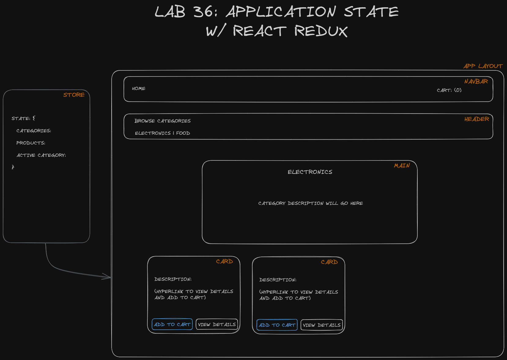
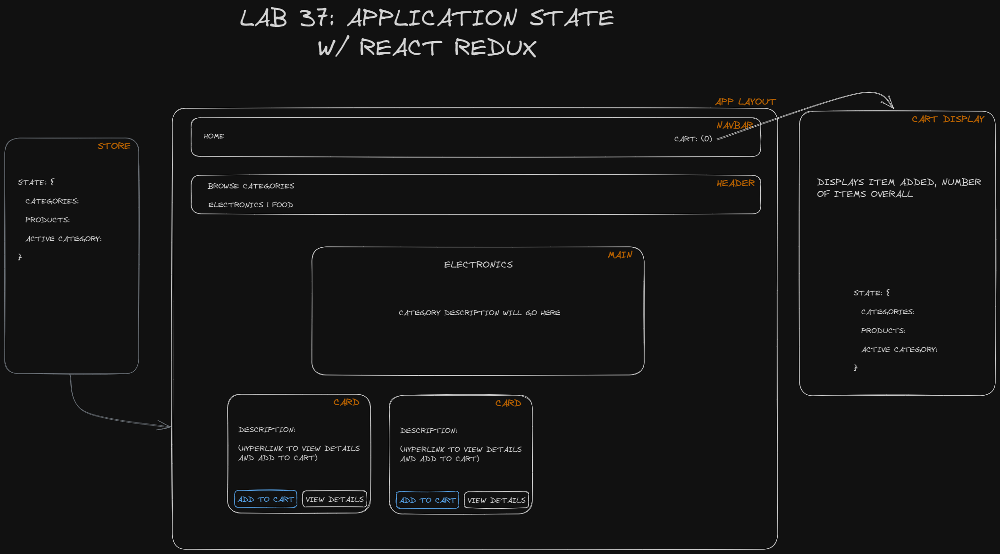

# LAB - Class 36

## Project: Application State With Redux

### Author: Ryan Eastman

### Problem Domain  

- **Lab 36: Phase 1** Today's assignment is to create an application using Vite. This will become our 4-phase build of the storefront application, written in React. Today, we'll be focusing on the global state of the application, and how to manage it using Redux. The goal for today is to have the scaffolding for our application complete with initial styling and behaviors, as well as setting up the file structure and state management so that we can progressively build this application.

*The following User/Developer Stories detail the major functionality for this phase of the project*:

- As a user, I expect to see a list of available product categories in the store so that I can easily browse products.
- As a user, I want to choose a category and see a list of all available products matching that category.
- As a user, I want a clean, easy to use user interface so that I can shop the online store with confidence.

- **Lab 37: Phase 2** Today, we'll be adding the shopping cart feature to our application. This will allow users to add items to their cart, view the contents of their cart, and remove items from their cart. We'll still be using Redux to manage the state of our application.

*The User/Developer Stories from before will remain unchanged.*

- As a user, I expect to see a list of available product categories in the store so that I can easily browse products.
- As a user, I want to choose a category and see a list of all available products matching that category.
- As a user, I want a clean, easy to use user interface so that I can shop the online store with confidence.

### Links and Resources

- [GitHub Actions ci/cd](https://github.com/DocHolliday13x/storefront/actions/)
- [Vite .env Docs](https://vitejs.dev/guide/env-and-mode.html#env-files)
- [Material UI](https://mui.com/core/)
<!-- - [back-end server url](http://xyz.com) (when applicable)
- [front-end application](http://xyz.com) (when applicable) -->

### Collaborators

- Ryan Galloway
- Reece Renninger
- Ike Steoger
- Nick Mullaney

### Setup

1. Start by using Vite to create a new React application.
2. `npm init vite@latest storefront -- --template react`
3. Navigate to new application and install dependencies.
4. `npm i redux react-redux @reduxjs/toolkit react-router-dom`
5. Create a new repository for your application.
6. Copy the URL of the repository.
7. In the terminal, navigate to the root of the application and run the following commands:
8. `git remote rm origin`
9. `git remote add origin <URL>`
10. `git push origin main`

#### `.env` requirements (where applicable)

for now I have none and do not require one

#### How to initialize/run your application (where applicable)

- Clone down the repo
- `npm i` to install dependencies
- `npm run dev` to start the application

#### How to use your library (where applicable)

#### Features / Routes

- Feature One: Details of feature
- GET : `/hello` - specific route to hit

#### Tests

- *How do you run tests?*
- *Any tests of note?*
- *Describe any tests that you did not complete, skipped, etc*

#### UML

1. **Phase 1**

- 

- 
